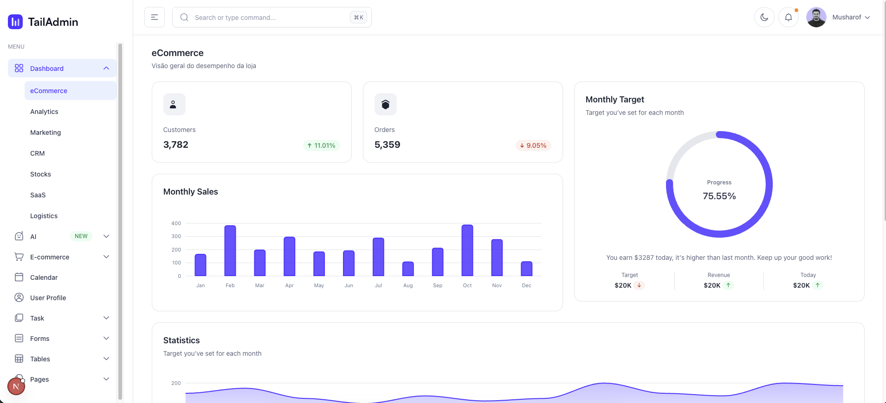

# Admin Template

Um template simples de painel administrativo, com componentes reutilizáveis e páginas de exemplo para servir de base a novos projetos.



## O que inclui

- Layout com menu lateral e barra superior.
- Dashboard com indicadores, gráficos e tabelas.
- Componentes como botões, cards, formulários, modais e notificações.
- Páginas de exemplo para usuários, produtos, perfil e configurações.
- Alternância entre tema claro e escuro.

Os dados das páginas de exemplo são fictícios e servem para demonstrar a interface.

## Tecnologias

Next.js, React, TypeScript, Tailwind CSS, Radix UI e ApexCharts.

## Como foi desenvolvido

Este template foi desenvolvido com o auxílio das [skills disponíveis em `.claude/skills/`](.claude/skills/). Elas reúnem instruções, scripts e referências que orientam agentes de IA na configuração do projeto e na conversão de um template HTML/CSS/JS em componentes Next.js, incluindo layout, menu lateral, barra superior, componentes de interface, gráficos e páginas de exemplo.

## Servidor MCP

A pasta [mcp-servers/](mcp-servers/) contém o **site-extractor**, um servidor MCP (Model Context Protocol) que permite a agentes de IA extrair páginas web usando Playwright. Ele baixa HTML, CSS, JavaScript, imagens e fontes, ajustando os caminhos dos arquivos para consulta local e uso como referência na conversão do template. Também oferece ferramentas para listar e remover os sites extraídos.

Veja os detalhes de instalação e uso no [README do site-extractor](mcp-servers/site-extractor/README.md).

## Como executar

```bash
cd frontend
npm install
npm run dev
```

Acesse [http://localhost:3000](http://localhost:3000) no navegador.
